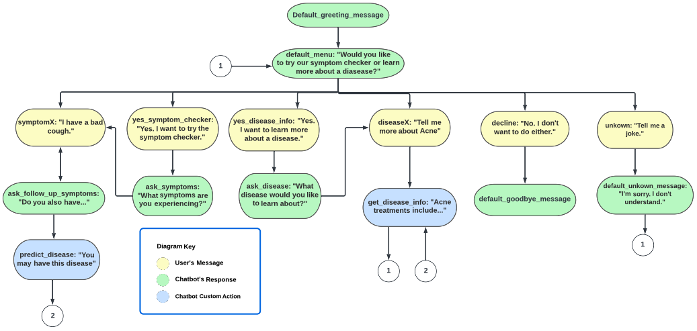

# Medical Chatbot

This project builds a medical chatbot that can predict a user's disease based on symptoms and return medical advice. The chatbot is built using RASA. The disease-symptom checking function is built using a pipeline model of three machine learning algorithms: Random Forest, Adaboost and Gradient Boost. 

## Getting Started Locally

To run the assistant locally you'll first need to clone. 

```
git clone https://github.com/MsNixon96/CSCI-595-Project.git
```

Next, install rasa. 

```
pip install rasa
```

Next you'll need to train the assistant. 

```
rasa train
```

Once trained, you can now talk to it. Since we're using custom python code 
in there we'll need to run an action server on the side. So first start an
action server via;

```
rasa run actions
```

With this running you can now talk to your assistant. 

```
rasa shell
```

## Extra Inspection 

If you want to get more of a view of what is happening you can also run; 

```
rasa shell nlu
```

By running it this way you'll get more of a glimpse in what the NLU components think.

If you want to supply the assistant with new data you can also 
handle this interactively via;

```
rasa interactive
```

## Features 

The medical chatbot has the following features;

- retrieve information about a disease
- predict a disease based on user's symptoms



The scope of our chatbot is further defined below:
-	The Medical Chatbot should be able to understand greetings and reply with a greeting. 
-	The Medical Chatbot should be able to understand goodbyes and reply with a goodbye. After replying with a goodbye, the chatbot should terminate the program. 
-	The Medical Chatbot should be able to understand if the user wants to know their predicted disease based on their symptoms. 
-	The Medical Chatbot should be able to understand if the user is inputting their symptoms and reply with follow-up questions to check if the user has any other symptoms as well. 
-	The Medical Chatbot should be able to predict the disease based on the user’s symptoms and reply with a predicted disease. 
-	The Medical Chatbot should be able to understand if the user wants to know more information about a disease. 
-	If the user doesn’t specify what information they want to know about a disease, the chatbot should ask if the user wants to know the description, symptoms, or treatments for a disease. 


To build a chatbot with Rasa, we will need the following files:

-	**data/nlu.md** : 
This file will contain the training data for Rasa NLU in json format. It lists the possible ways a user might utter an intent. For example, the user might say “Hey” or “Hi” for a “greeting” intent. The file also labels any entities that may be found in a user’s text. For example, if the user inputs “I want to order a cheese pizza”, the entity is  “cheese pizza” and the entity type is “order_item”.

-	**config.yml** : 
This file lists the configuration settings for Rasa NLU and Rasa Core pipelines. It specifies the NLU pipeline to use, the policies for dialogue management, and other important settings.

-	**domain.yml** : 
This file lists all the intents, entities, slots, actions, and responses for our chatbot. Slots are used to keep track of any user information that will be needed for future actions. For example, an “order_details” slot might be used to remember a user’s order items throughout the conversation. The chatbot can then use this slot to confirm a user’s order. 

-	**data/stories.yml** : 
This file contains possible conversation flows, named stories, between the user and the chatbot. Each story lists a user’s input, followed by the chatbot’s actions, or expected responses. 

-	**actions.py** : 
This file contains any custom actions that the chatbot may need to perform. For example, the chatbot may need to retrieve information from a database. 


The actions.py file contains the following custom actions:
- **retrieve info for a disease from a database** : symptom_Description.csv and symptom_precautin.csv will be used as the disease info database. The function takes a disease name and returns the information about the disease to the user. 

- **predict a disease based on a user's symtpoms** : this function loads a pretrained machine learning model and uses it to predict a disesase based on a user's symptoms. The function returns the name of the disease. 


The ChatbotApp.py file contains the code for the TKinter GUI interface. To use the trained RASA chatbot with the TKinter interface, run the Chatbot.App.py file. 
